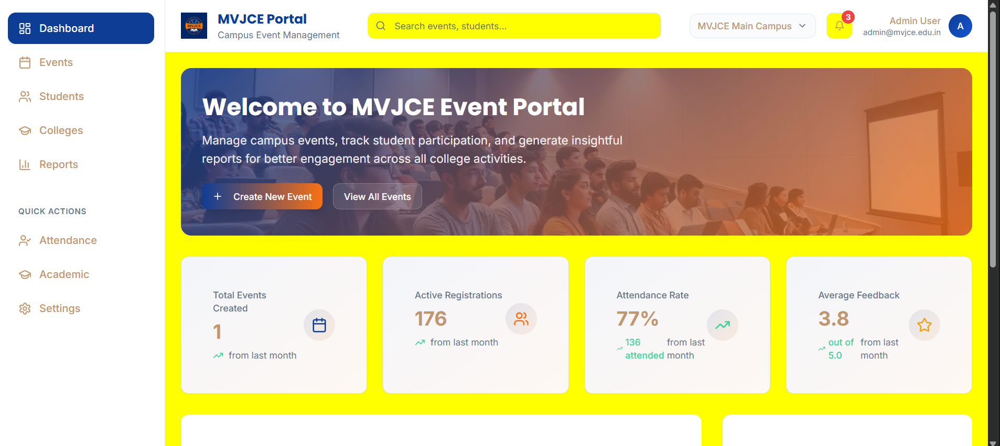
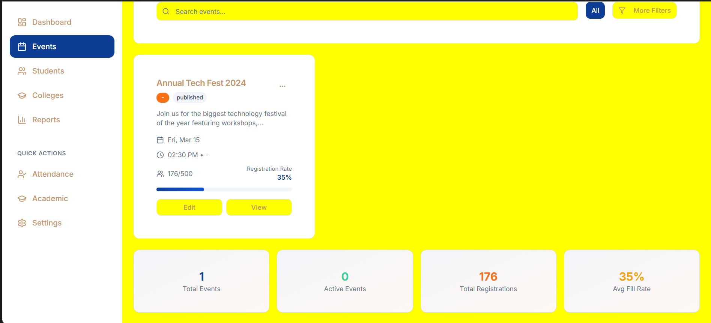
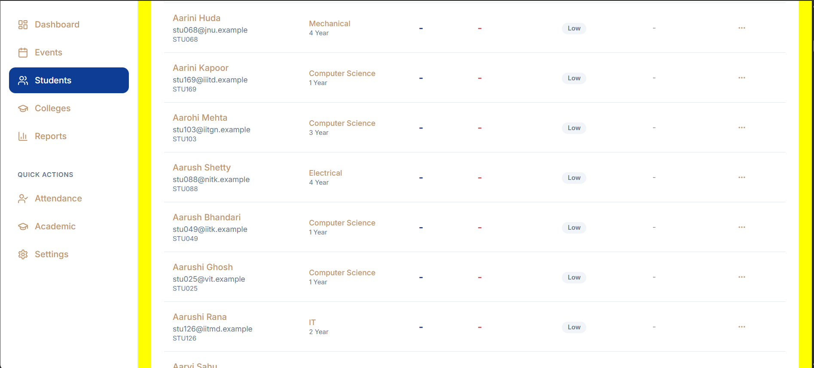
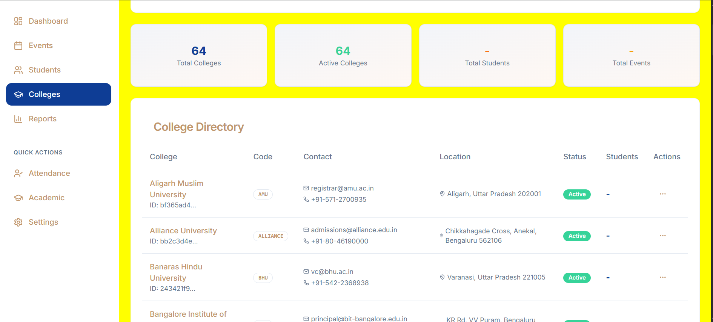
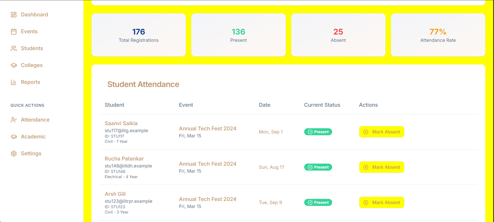
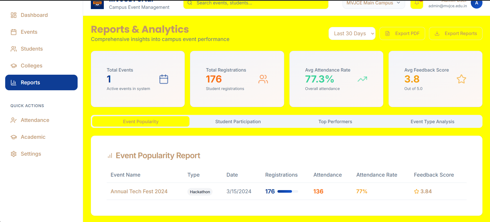
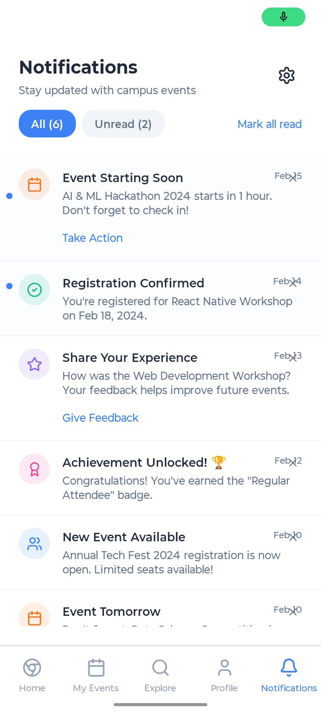
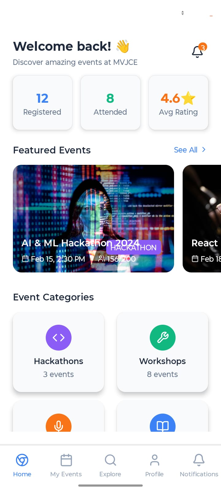
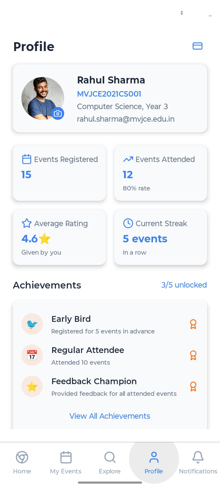

## Web Portal Screenshots

### Dashboard

### Events

### Students

### Colleges

### Attendance

### Reports

#

## Mobile App Screenshots

## PDF Reports

### Complete Campus Events Report
The system now generates comprehensive PDF reports that include all analytics and data insights.

**📄 [Campus Events Complete Report - January 9, 2025](./Report%20Pdf/Campus_Events_Complete_Report_9-11-2025.pdf)**

**📄 [Campus Events Report - Enhanced Version](./Report%20Pdf/Campus_Even_2.pdf)**

#### Report Features:
- ✅ **Key Metrics Overview** - Total events, registrations, attendance rate, feedback scores
- ✅ **Event Popularity Analysis** - Top 10 most successful events with detailed metrics
- ✅ **Student Participation Report** - Top 15 most active students with engagement data
- ✅ **Top Performers Recognition** - Gold, Silver, Bronze rankings with achievements
- ✅ **Event Type Analysis** - Performance comparison across different event categories
- ✅ **Executive Summary** - Professional conclusion and system insights

